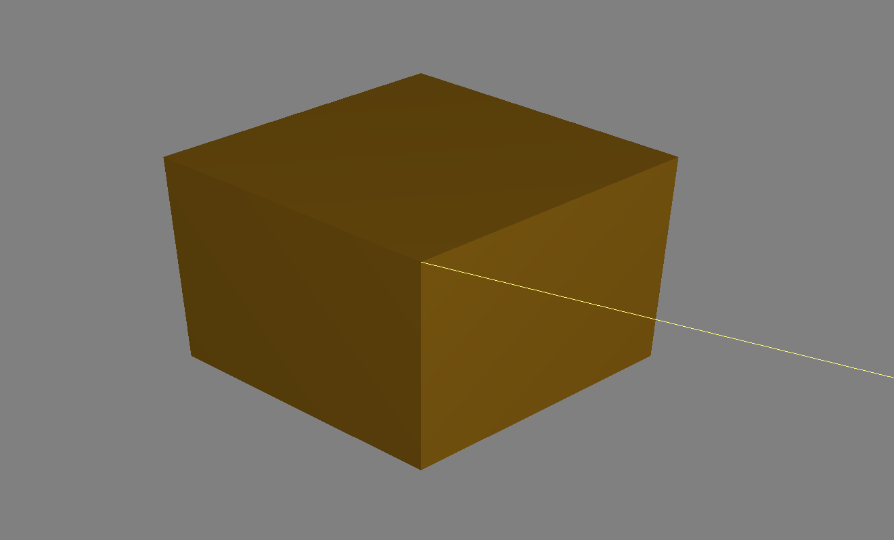
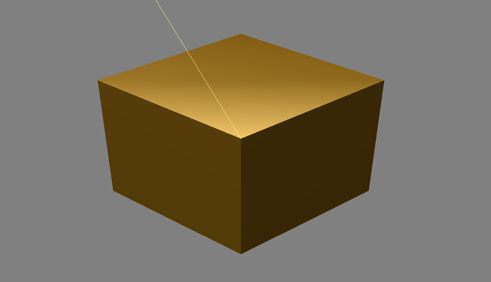
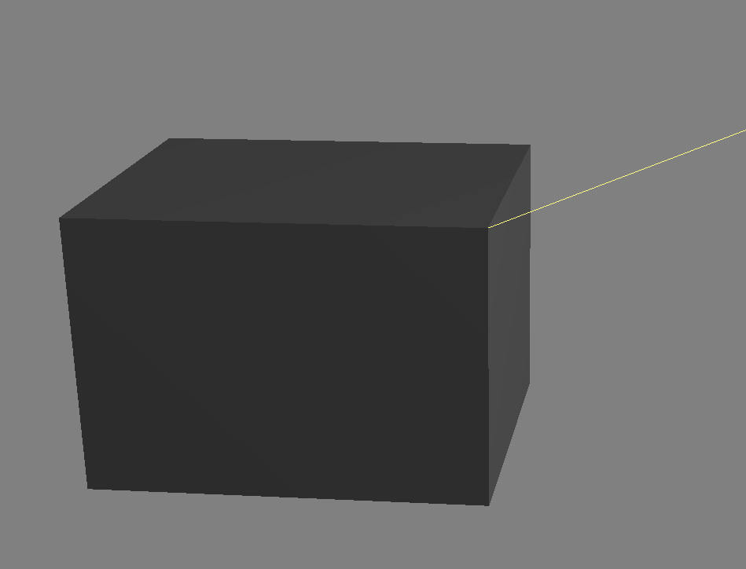

# Dynamic-Lighting
A controllable light source that shins on a 3D cube in C++

Download the package, run the .exe.\n 
You can move the cameras x,y,z position, tilt the camera on all axis and move the light source.\n
The cube can changed between bronze and grey.\n
The yellow line is the lightsource vector.\n

